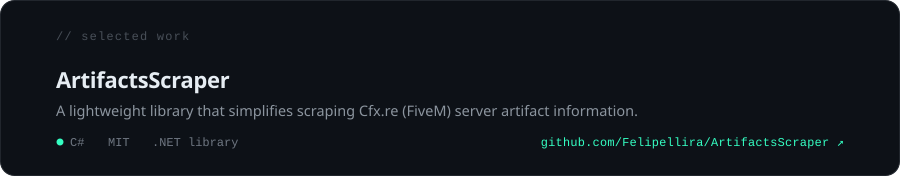
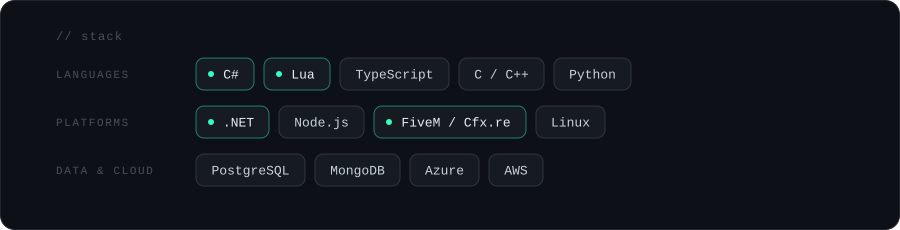

Backend-leaning software engineer, self-taught. Most of my time goes into .NET services, developer tooling and the FiveM modding scene, with a standing interest in software architecture and in code that is still pleasant to work with a year later.

  
  
  

