<picture>
  <source media="(prefers-color-scheme: dark)" srcset="assets/header-dark.svg">
  
</picture>

Backend systems and the tooling around them. Mostly .NET and the Cfx.re runtime; occasionally everything else.

#### work

<code>2025</code>&ensp;[ArtifactsScraper](https://github.com/Felipellira/ArtifactsScraper) — typed access to Cfx.re server artifacts, from C#.

#### elsewhere

[felipeluigilira@proton.me](mailto:felipeluigilira@proton.me) · [linkedin](https://www.linkedin.com/in/felipellira/) · [discord](https://discord.com/users/889898811529502740)
